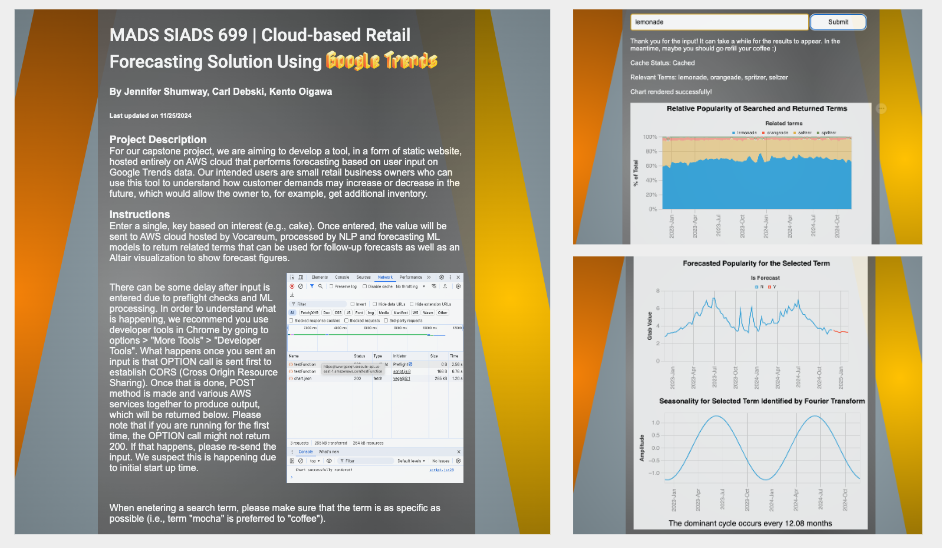

# Project Description

 This is a README for codes used on a capstone project for Master of Applied Data Science at the University of Michigan School of Information. In our project, we aimed to create a cost-effective, cloud-based (AWS) tool that performs forecasting of semantically related terms on Google Trends. The motivation for the project was to apply data science knowledge we had learnt throughout the graduate program, and chose to make a cloud-based tool to implement user interface as in business environment there are many pre-built, ready-to-use tools and services available, meaning that there is increased need to be able to put things together in a timely manner and below budget.
