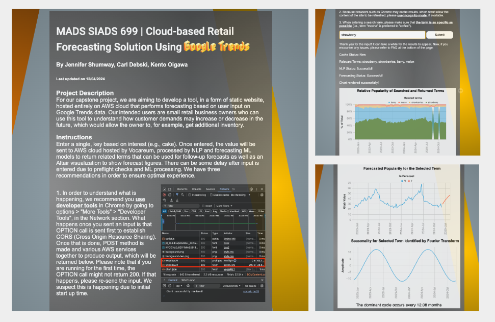

# Creating a cost-effective, lightweight tool hosted on Cloud services that forecasts popularity of terms on Google Trends for small retail business owners

<b>Date</b>: 2024/12/09<br>
<b>Members</b>: Jennifer Shumway, Carl Debski, Kento Oigawa


## Project Description

<br>This is a README for codes used on a capstone project for Master of Applied Data Science at the University of Michigan School of Information. In our project, we aimed to create a cost-effective, cloud-based (AWS) tool that performs forecasting of semantically related terms on Google Trends. The motivation for the project was to apply data science knowledge we had learnt throughout the graduate program, and chose to make a cloud-based tool to implement user interface as in business environment there are many pre-built, ready-to-use tools and services available, meaning that there is increased need to be able to put things together in a timely manner and below budget.

## Content
There are three main files within the repository under the acronym of each team member: 
<ul>
<li>“<b>cdebski</b>” contains scripts, Jupyter notebooks and requirements.txt file for natural language processing (NLP).</li>
<li>“<b>jshumway</b>” contains scripts, Jupyter notebooks and requirements.txt file for extracting Google Trends data and for performing both forecasting and identification of seasonality on that data.</li>
<li>“<b>koigawa</b>” contains codes, scripts,  and requirements.txt file used to build a static website and SageMaker application that incorporates scripts within “cdebski” and “jshumway” folders.</li>
</ul>

## Understanding Code & Example Workflows

## How to deploy the tool to AWS
In order to deploy the tool, you have to make sure that you have a valid AWS account and the correct configuration. Below are <b><ins>non-exhaustive</ins></b> instructions and details on configuration for the solution which was implemented for our project. Please note that there are many approaches to this and that there is no single solution. For example, instances can be much larger than the one we have used, depending on your specific needs and available resources.

### API Gateway 
<b>Why this service is needed</b>: This service acts as an entry point into AWS for the tool when you are passing values, as JSON payload, entered by the user. This service can be invoked by calling on the URL defined in the endpoint.<br><br>
<b>Instructions</b>: 
<ul>
<li>Create HTTP API</li>
<li>Configure Web API with POST and OPTIONS routes</li>
<li>Configure Cross-Origin Resource Sharing</li>
<li>Configure Integrations with Lambda function (Make sure you have a Lambda function made prior to this)</li>
<li>Take note of the url within “Default endpoint” and the name of Routes as this will be required to call API from JavaScript</li>
</ul>

### EC2 
<b>Why this service is needed</b>: This is needed for deploying the tool by building and pushing codes as Docker image to Elastic Container Repository.<br><br>
<b>Configuration</b>:
<ul>
<li>Instance type: t2.micro</li>
<li>OS: Amazon Linux 2</li>
<li>EBS: gp2 of size 32 GiB</li>
</ul>
<b>Instructions</b>:
<ul>
<li>Launch Amazon Linux 2 instance</li>
<li>Install Python3.12, Docker</li>
<li>Depending on the storage size, increase volume if you encounter any storage issues when you are installing packages or building Docker images</li>
<li>Clone this github repository</li>
<li>Build and push content within koigawa/lambda_app as a Docker image into a repository you have created in Elastic Container Repository, where you can find scripts to run on EC2 are available there. Make sure that you start the Docker before doing so by running</li>
</ul>

        sudo systemctl start docker

<ul>
<li>Create DynamoDB instance (either via CLI or interface) and change below “QueryTerms” into the instance name that you have chosen</li>
</ul>

        table = dynamodb.Table('QueryTerms')
        item_key = {'input': key_word}
        response = table.get_item(Key=item_key)

### Lambda
<b>Why this service is needed</b>: This is the serverless tool which will house the main Python script for the tool. It is triggered by a POST call passed through by API Gateway and performs a bunch of tasks such as calling DynamoDB, calling SageMaker endpoint, and then saving JSON output from Altair charts rendered into S3.<br><br>
<b>Configuration</b>:
<ul>
<li>Architecture: x86_64</li>
<li>Memory: 1024 MB</li>
<li>Timeout: 15 mins</li>
<li>Environment variables:</li>
<ul>
<li>SM_ENDPOINT_NAME: <i>{Enter name of your endpoint here}</i></li>
<li>SM_INFERENCE_COMPONENT_NAME: <i>{Enter name of inference component name here}</i></li>
</ul>
</ul>
<b>Instructions</b>:
<ul>
<li>Create Lambda function from a Docker image that you have built in EC2 and sent to ECR</li>
<li>Configure IAM Role to ensure that the function can write log into CloudWatch Logs, run SageMaker and access S3</li>
<li>Ensure integration with API Gateway by configuring Lambda Integration within API Gateway</li>
</ul>

### S3 
<b>Why this service is needed</b>: Because the tool will be a static website, S3 will be used to store the main code (JavaScript, HTML and CSS) as well as any other relevant data such as JSON for the Altair chart which will get rendered to the user.<br><br>
<b>Configuration</b>:
<ul>
<li>Bucket Versioning: Enabled (Not required)</li>
<li>S3 static website hosting: Enabled</li>
<li>Block all public access: Disabled</li>
</ul>
<b>Instructions</b>:
<ul>
<li>Create an S3 with the above configuration</li> 
<li>Upload the content within koigawa/static_site into the newly created bucket</li>
<li>Click the URL link on Bucket website endpoint to confirm that it is working</li>
<li>On a local machine, download all files from this site and, in the active directory, create model.tar.gz as per below code and save it as s3://{your_bucket_name}/model/model.tar.gz, as this is needed later in SageMaker setup</li>
</ul>

```
mkdir model_files
cp fast* model_files/
tar -czvf model.tar.gz -C model_files .
```

<ul>
<li>On a local machine, download jshumway/lstm_40_epochs.keras and save it under as s3://{your_bucket_name}/model/lstm_40_epochs.keras.</li>
</ul>

### SageMaker
<b>Why this service is needed</b>: SageMaker is needed to host NLP process. The model will be called by Lambda function to have similar terms returned.<br><br>
<b>Configuration</b>:
<ul>
<li>Min CPU memory: 128</li>
<li>Min number of copies: 1</li>
<li>Instance type: ml.m5.large</li>
</ul>
<b>Instructions</b>:
<ul>
<li>Set up SageMaker studio</li>
<li>Within EC2, build and push Docker image from within the content of koigawa/nlp_sagemaker_app and note down the URI of the image</li>
<li>Register a model using URI of the image and the model saved within S3 bucket as s3://{your_bucket_name}/model/model.tar.gz</li>
<li>Deploy inference endpoint from the model using the configuration above</li>
</ul>

